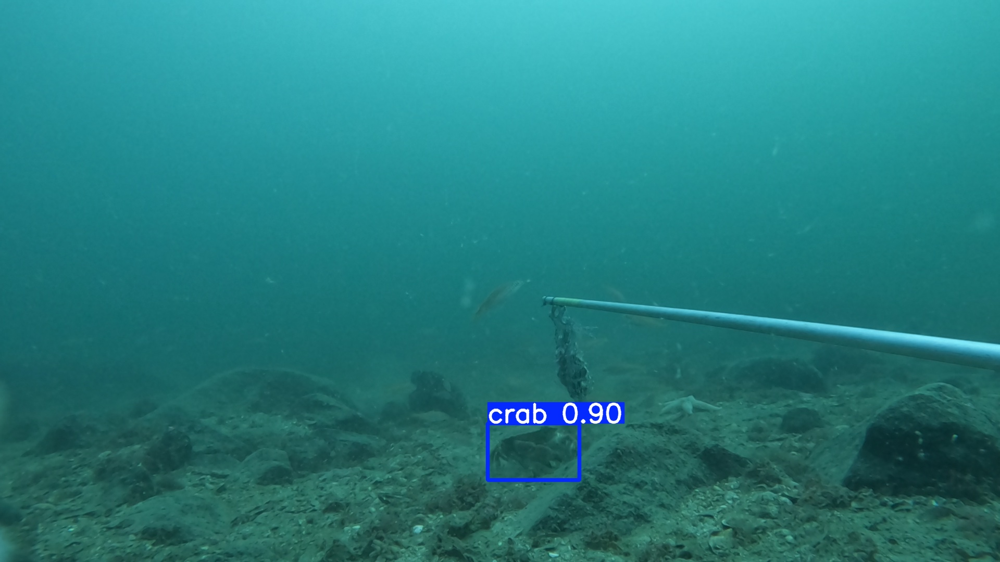

<div align="center">
# Crabs on camera



Code and pipeline for detecting brown crabs (*Cancer pagurus*) in underwater video, developed from the methods described in my master's thesis and a forthcoming article.

**Detect and count brown crabs in BRUV footage using a pretrained YOLOv8 model, from raw video to filtered MaxN data.**

The repository is split into two workflows:

| Folder | Purpose |
|---|---|
| `create-a-crab-detector` | Trains a YOLOv8 object detection model on annotated BRUV frames |
| `use-a-crab-detector` | Applies the pretrained detector (or your own model) to new footage and runs the post processing pipeline to produce filtered MaxN data |

**Documentation:** [ginabroten.github.io/crabs-on-camera](https://ginabroten.github.io/crabs-on-camera/), background, prerequisites, and a walkthrough of each script.

**Thesis:** Brøten, Gina. 2026. *Crabs on camera: Improving the monitoring of the brown crab (Cancer pagurus) with machine learning and Baited Remote Underwater Video (BRUV)*. Master's thesis, University of Bergen. <https://hdl.handle.net/11250/5537346>

**Article:** [citation to be added once published]

## Following along with the article

Each stage of the pipeline corresponds to a step in the Methods section of the article and the thesis (Chapter 2.3):

| Methods step | Repo location |
|---|---|
| Selection of data | `create-a-crab-detector/script/setup-scripts-optional/extract_frames`, `annotation_stats.ipynb` |
| Image annotation and preparation | `create-a-crab-detector/script/1-raw_to_yolo.ipynb` |
| Model training | `create-a-crab-detector/script/2-train.ipynb` |
| Model validation and selection | included in `2-train.ipynb` |
| Model evaluation | `use-a-crab-detector/script/3-interpret-raw-detections.ipynb` |
| Model application and inference | `use-a-crab-detector/script/1-get-ready-to-use-a-crab-detector.ipynb`, `2-use-a-detector.ipynb` |
| Post processing pipeline | `use-a-crab-detector/script/4-post-processing-pipeline.ipynb` |

Grad CAM analysis and the statistical comparison of MaxN against crab pot catch (thesis section 2.4) are described in the article and thesis but are not part of this code repository.

## Quick start

```bash
git clone https://github.com/ginabroten/crabs-on-camera.git
cd crabs-on-camera/use-a-crab-detector
pip install -r requirements.txt 
```

`torch` may need a separate install matching your CUDA version or CPU only setup. See the [official PyTorch instructions](https://pytorch.org/get-started/locally/) if the default install does not work for your machine.

Then follow the numbered notebooks in `script/`, starting with `1-get-ready-to-use-a-crab-detector.ipynb`, or see the full walkthrough in the documentation above.

To train your own detector instead, see `create-a-crab-detector/requirements.txt` and its own script folder.

## Citation

If you use this pipeline or the pretrained detector, please cite the thesis above (article citation to follow).
