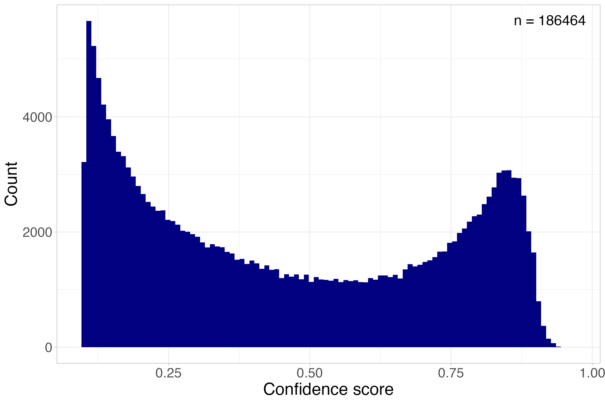

# Use a crab detector

## Background
The aim of this leg of the repository is to go from unseen data to assessment ready data, where unseen video material is the input and the output is the relative abundance indices MaxN and MeanN per BRUV/video station obtained with either the pretrained crab detector, or another model. 

MaxN is the single image frame within a deployment with the highest count of individuals per deployment, wheras MeanN is the mean number of individual observed over a series of image frames [@whitmarsh_what_2017]. MaxN is the most commonly applied metric ofr estimating abundances in video-based surveys, and its conservative with its aim to reduce the likelihood of double counting individuals.

The pretrained crab detector developed in the thesis is included in this repository, in the folder `use-a-crab-detector/model/pretrained-crab-detector`. This model is not yet plug and play, as documented in the thesis, and in the literature more broadly, YOLO models in particular struggle to generalize: when the input material shifts away from the domain it was trained on, performance drops. Specifically, this model was trained to detect brown crab in BRUVs placed in nearshore coastal areas between 62°N and 68°N. When applied outside this scope, whether due to a different video collection method or a different environment, it's going to struggle (see the FjordFish test in Brøten [-@broten_crabs_2026]).

If you'd still like to apply this detector given these caveats, or apply a new (and likely better) model, some manual work is still needed. To interpret the model's predictions, we need some understanding of its generalizability. One important step is building an independent test set: annotate a small subset of unseen data, let the model predict on it, then compare the model's predictions against the human-annotated ground truth.

Recommended running order: 
1. `get-ready-to-use-a-crab-detector`
2. `use-a-detector`
3. `interpret-raw-detections`
4. `post-processing-pipeline`


## Before running the detector - independent test set

Often described as the gold standard for evaluating a trained models performance, and applied after a model is fully trained to assess the ability of the model to generalize, and its ability to detect general features of crabs rather than memorizing its training data [@biscarini_deep_2026. In this instance, its purpose is rather to evaluate the models "compatibility" with the data its going to predict upon. The model will predict on a small annotated dataset, and the predictions will be compared to the annotations. All this is done in the script `get-ready-to-use-a-crab-detector`.

### Setup an collecting predictions (Chunk 0 -- 2)
To start, you will need a fully annotated dataset, it does not need to be big, and is often around 10 -- 25% of the available data. This data needs to be annotated (look in `create-a-crab-deetctor/setup-scripts-optional` for scripts to collect frames for annotation and predictions and for annotation setup), exported as COCO 1.0, and put in the folders, `use-a-crab-detector/data/test_predictions` prior to running the script. Make sure the paths are correct, if applying another model. 

Likewise to the data processing pipeline performed in `raw_to_yolo` the annotations are converted from RLE-masks to bounding boxes, and only the crab annotations are kept. The scrips logic for grouping is still based on the naming convention as previously mentioned, if the dataset uses another naming convention the code needs to be readjusted. The model will then predict on the dataset assigned, these are saved in `use-a-crab-detector/data/test_predictions/predictions.json`.

### Comparing model predictions to human ground truth (Chunk 3 -- 6)

First the per stations maxN, meanN and total crab count from the human-anotated test set is collected, this is the ground truth the predictions are compared against, then the same is done for the models predictions. Duplicated bounding boxes (two bounding boxes overlapping) are removed, and every image at a station is counted even when the model found nothing. 

As the model predicts it assigns a confidence score to the prediction from 0 -- 1 based on how sure it is, the confidence threshold for predictions can be adjusted. High confidence thresholds keeps only the models most certain predictions (fewer false detections, but real crabs might be missed), wheras low confidence thresholds introduce introduces noise but retains more predictions. Because there is no single correct threshold, the script evaluates several thresholds (none, 0.5 and 0.75 by default) so you can see the trade-off rather than guessing. 

The script saves two things: `threshold_summary.csv`, with one row per threshold
giving the total crab count and average maxN/meanN for both the human annotator alongside three bar charts (`total_crabs_by_station.png`, `maxN_by_station.png`, `meanN_by_station.png`) comparing the human truth against the model at each threshold.

In the thesis, this comparison highlighted that neither a low or a high threshold was able to give an accurate MaxN prediction and highlighting the need for a more flexible solution for interpreting the detentions, this is covered in the post-processing-pipeline. To ruther understand what features drove the detector to make a prediction, a Grad-CAM analysis can be performed, which produces a heatmap highlighting important areas for detection.

## Running the detector 

### Applying the detector to new footage

Once the crab-detector returned acceptable results on the independent testset, `apply-a-crab-detector` runs the model across a full folder of new BRUV videos. Point it (change the path) at the folder containing the desired footage and desired model, its also possible to change the image size, hyperparamteres (though these should be close to the initial training setup) and confidence threshold.The script makes the detector predict roughly every second(matching the extraction of training data), but this can be changed, runs the detector on these frames and collects every detection into a single `predictions.json` file. 

The confidence threshold is set to be deliberately low (0.1), hence the script is not deciding what counts as a "real" crab, just recording every prediction. The actual filtering, so choosing a confidence threshold and removing likely false detection happens in the next steps.  

Before running this on a large batch, it is worth checking that the video filenames march the expected deployment naming logic, the script reports how many unique deployments it found and flags any videos it could not match. By default this script only saves the detections and not annotated videos, to activate this there is a toggle in the scripts configuration to save a copy of each video with the predicted videos drawn in, off is the default since it adds significant disk use and processing time.

### Checking what the model found

Before doing any real filtering, it is worth looking at what the detector actually predicted. `summarize_detections` reads the `predictions.json` file and reports the total number of detections, how many frames had at least one and how many detections fall above a couple confidence cutoffs (0.5 and 0.75 by default). It plots a histogram of the confidence score of every detection as a sanity check, and should (if you are applying the pretrained model) have a bimodal structure, with a high peak withing the lower end of confidence scores, and a second smaller peak with the higher scores (Figure \@ref(fig:histpreds24)),

```{r histpreds24, echo=FALSE, fig.cap = "Distribution  of confidence scores for crab predictions generated by the object detection model on BRUV videos from the 2024 gill- and fyke-net survey (Brøten, 2026). A confidence score reflects how certain the model is in its prediction of a crab from 0 to 1, where 1 indicates the highest model certainty. Each prediction represents a detection within a single frame, and not necessarily a unique individual."}


```


## Post-processing-pipeline

This step is optional, but shows the workflow for removing likely false dete

## Collecting results

a csv with the maxN/meanN per station, combine wiht lat/lon etc to apply in species distribution models+
